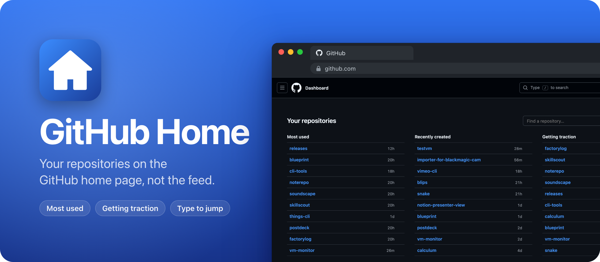
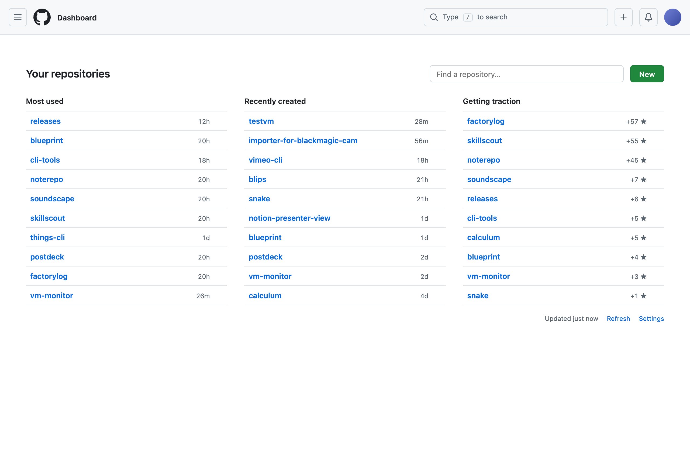

GitHub Home is a Chrome extension that replaces the GitHub home page with a list of your repositories. You see the ones you work on the most, the ones you created recently, the ones getting stars this week, and a search box to jump to any of them.

I open github.com to get to one of my repos, and the home page shows me a feed instead. With GitHub Home, I land on my repos, type a few letters and press Enter.

<picture>
  <source media="(prefers-color-scheme: dark)" srcset="docs/screenshot-dark.png" />
  
</picture>

## Install

GitHub Home isn't on the Chrome Web Store, so you load it into Chrome yourself. It takes a couple of minutes.

1. Get `GitHub-Home-1.2.0.zip` from the [latest release](https://github.com/flaviocopes/github-home/releases/latest) and unzip it.
2. Move the `GitHub-Home-1.2.0` folder somewhere it can stay, like your Documents folder. Chrome runs the extension from that folder, so if you delete it, GitHub Home is gone.
3. Open `chrome://extensions` and turn on **Developer mode** in the top right corner.
4. Click **Load unpacked** and pick that folder.
5. The settings page needs a GitHub token. Click the puzzle icon in the toolbar, then GitHub Home, and paste the token there.

### The token

GitHub Home reads your repositories with the GitHub API, so it needs a token.

[Create a classic token](https://github.com/settings/tokens/new?scopes=repo&description=GitHub%20Home%20extension) with the `repo` scope. That scope is what lets it see private repos and the ones in your organizations. If an organization uses SAML single sign-on, authorize the token for it on the tokens page, or its repos won't show up.

If you use the GitHub CLI, `gh auth token | pbcopy` copies a token you can paste instead.

### Updates

An extension you load this way doesn't update on its own. When there's a new release, unzip it and copy its files into your GitHub Home folder, replacing the old ones. Then click the reload arrow on the GitHub Home card in `chrome://extensions`. Your token and visit history stay.

To hear about new versions, click **Watch** on this repo, then **Custom** and **Releases**.

## Features

- **Most used** lists the 10 repos you work on the most right now, with the time of the last push.
- **Recently created** lists your 10 newest repos, with how long ago you created them. Forks are left out.
- **Getting traction** lists the 10 public repos that got the most stars in the last 7 days, with the count.
- Each repo is one line: its name, a **Private** label if it's private, and a time or a star count. Hover over it to see the description.
- Star a repo with the ☆ that shows up when you hover over it, in any list or in the search results, and it stays at the top of **Most used**. Click the ★ again to unstar it. These stars live in the extension, not on GitHub, so they don't change a repo's star count.
- The search box has the focus when the page loads. Type part of a name or a description, move with the arrow keys, and press Enter to open the repo. Cmd+Enter (Ctrl+Enter on Windows and Linux) opens it in a new tab, and Escape clears the search.
- The search covers every repo, not only the ones in the lists: the repos you own, the ones in your organizations and the ones you collaborate on.
- It follows GitHub's light or dark theme, because it uses GitHub's own colors.
- Logged out, you see the normal GitHub home page.

## How "Most used" works

Each repo gets a score from three things:

- your commits on its default branch in the last 90 days
- how often you opened it in this browser
- how recently someone pushed to it

Visits and pushes count less as they get older. Visits to the same repo less than 30 minutes apart count once, so browsing around a repo for an hour is one visit, not fifty.

The commit counts come from each repo's own history, not from your contribution graph. GitHub leaves private repos out of the contribution data, even when you ask about your own account, so the graph misses most private work.

## How "Getting traction" works

For each repo pushed in the last 90 days, GitHub Home reads its newest 100 stars and counts the ones from the last 7 days. A repo you released last week that got 50 stars shows up. An old repo with thousands of stars and none this week doesn't.

It only lists public repos you own or that belong to your organizations, and leaves out forks.

## The cache

The lists are cached, so the page shows up right away. When the cache is older than 5 minutes, GitHub Home refreshes it in the background. The **Refresh** link at the bottom of the page does it right away.

## Privacy

The token stays in Chrome's extension storage, and GitHub Home only sends it to `api.github.com`.

To count visits, the extension runs on github.com pages and saves the `owner/repo` part of the address with the time, in Chrome's extension storage. It keeps the last 50 visits per repo and forgets a repo after 180 days without a visit. **Clear visit history** in the settings deletes all of it.

The repos you star in the extension are saved there too.

There are no accounts, no analytics and no other servers.

## Build it from source

There's no build step. Clone the repo and load the folder itself with **Load unpacked**, as in the install steps. After you edit a file, click the reload arrow on the GitHub Home card and reload the GitHub tab.

To make the release zip, run:

```sh
scripts/build-release.sh
```

It copies the extension files into `dist/GitHub-Home-<version>.zip` and prints its SHA-256. The same commit always gives the same zip, so you can check that a release matches its tag.

## Development

The test loads the extension into Playwright's Chromium, on a fake github.com with demo data, so it needs no token. It checks the home page, the search, GitHub's in-page navigation, visit tracking, the settings page and the error states. You need Node.js:

```sh
npm install
npx playwright install chromium
npm test
```

`npm run screenshots` renders the README screenshots from the same demo data, and `npm run preview` does it with your own repos, using the token from the GitHub CLI. The banner comes from `scripts/banner.html`. Render it again with `npm run banner`.

Working with an AI coding agent? Point it at [AGENTS.md](AGENTS.md). It has the commands and the rules to follow.

## How it works

The service worker, `src/background.js`, asks the GitHub GraphQL API for your repositories, 100 at a time, sorted by last push. For each repo pushed in the last 90 days, it counts your commits on the default branch and the stars from the last 7 days, 10 repos per request, all in parallel. It saves the result in `chrome.storage.local`.

The content script, `src/content.js`, starts before the page draws. On the home page, a CSS rule hides GitHub's content, and the script injects the list in its place, rendered from the cache. GitHub swaps pages without a full reload, so a `MutationObserver` watches for the address to change and puts the list back when you return home.

The test loads the extension through the DevTools protocol's `Extensions.loadUnpacked`, since Chrome 137 stopped accepting the `--load-extension` flag.

## License

[MIT](LICENSE)
